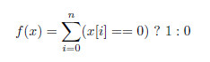

Get Started - Tutorial
============================================================================

Pyevolve combined with the Python language can be a powerful tool. The best way to show you how Pyevolve can be used is to begin with some simple examples; later we'll show some snippets, etc. so you'll be alble to walk by yourself.

First Example
---------------------------------------------------------------------------

To make the API easy to use, we have provided default values for almost every parameter in Pyevolve.
For example, when you use the :class:`G1DList.G1DList` genome without specifying the Mutator, Crossover and Initializator, you will be using the default ones: Swap Mutator, One Point Crossover and the Integer Initialzator. All those default parameters are specified in the :mod:`Consts` module (and you are highly encouraged to take a look at source code).

Let's begin with the first simple example (Ex. 1). First of all, you must know your problem: in this case, our problem is to find a simple 1D list of integers of *n*-size with zero in all positions.
At first look, we know by intuition that the representation needed for this
problem is a 1D List, which you can find in Pyevolve by the name of :class:`G1DList.G1DList`, which means Genome 1D List. This representation is based on a python list as you will see, and is very easy to manipulate.
The next step is to define the :term:`evaluation function` to our Genetic Algorithm. We want all the *n* list positions with value of '0', so we can propose the evaluation function:

As you can see in the above equation, with the *x* variable representing our genome list of integers, the *f(x)* shows our evaluation function, which is the sum of '0' values in the list. For example, if we have a list with 10 elements like this: ::
   
   x = [1, 2, 3, 8, 0, 2, 0, 4, 1, 0]

we will get the raw score [#rawscore]_ value of 3, or *f(x)* = 3. It's very simple to understand. Now, let's code this.

We will define our :term:`evaluation function` **"eval_func"** as: ::

   # This function is the evaluation function, we want
   # to give high score to more zero'ed chromosomes
   def eval_func(chromosome):
      score = 0.0

      # iterate over the chromosome elements (items)
      for value in chromosome:
         if value==0:
            score += 1.0
      
      return score

As you can see, this evaluation function tests each element in the list for equality with '0' and returns the proportional score value. The :class:`G1DList.G1DList` chromosome is not a python list by itself but it encapsulates one and exposes the methods for this list, like the iterator used in the above loop.
The next step is the creation of a :term:`sample genome` [#samplegenome]_ for the Genetic Algorithm. We can define our genome as this: ::

   # Genome instance
   genome = G1DList.G1DList(20)

   # The evaluator function (objective function)
   genome.evaluator.set(eval_func)

This will create an instance of the :class:`G1DList.G1DList` class (which resides in the :mod:`G1DList` module) with the list *n*-size of 20 and sets the evaluation function of the genome to the evaluation function **"eval_func"** that we created before.

But wait - where is the range of integers that will be used in the list? Where are the mutator, crossover and initialization functions? They are all set to their default parameters. Using these parameters keep things simple.

By default (and you have the **documentation** to find these defaults), the range of the integers in the :class:`G1DList.G1DList` is between the inverval [ :attr:`Consts.CDefRangeMin`, :attr:`Consts.CDefRangeMax`] inclusive, and genetic operators is the same I have cited before: Swap Mutator :func:`Mutators.G1DListMutatorSwap`, One Point Crossover :func:`Crossovers.G1DListCrossoverSinglePoint` and the Integer Initializator :func:`Initializators.G1DListInitializatorInteger`. You can change everything with the API. For example, you can pass the ranges to the genome like so: ::

   genome.setParams(rangemin=0, rangemax=10)

Right, now that we have our evaluation function and our first genome ready, the next step is to create our Genetic Algorithm Engine, the GA Core which will do the evolution, control statistics, etc... 
The GA Engine which we will use is the :class:`GSimpleGA.GSimpleGA` which resides in the :mod:`GSimpleGA` module. This GA Engine is the genetic algorithm [#ganote]_ described by Goldberg. So, let's create the engine: ::

   ga = GSimpleGA.GSimpleGA(genome)

The GA is now ready to use. We have simply created our GA Engine with the previously created genome. You might be asking: "*Where did we set the selector method, the number of generations, and the mutation rate?*". Again: we are using the default settings. By default, the GA will evolve for 100 generations with a population size of 80 individuals, it will use the mutation rate of 2% (there is a 2% chance that each individual created in a generation is mutated using the chosen mutation operator) and a crossover rate of 80% (there is an 80% chance that each individual created in a generation is created using the chosen crossover operator), the default selector is the Ranking Selection (:func:`Selectors.GRankSelector`) method. Those default parameters were not picked at random, they are all based on the commonly used settings.

Now, all we need to do is to evolve the population! ::

   # Do the evolution, with stats dump
   # frequency of 10 generations
   ga.evolve(freq_stats=10)

   # Best individual
   print ga.bestIndividual()

.. note:: Pyevolve have the __repr__() function  implemented for almost all objects, this means that you
          can use syntax like 'print object' and the object information will be show in an
          pretty format.

Ready, now we have our first Genetic Algorithm. It looks more like a "Hello GA!" application. The code above shows the call of 
the :meth:`GSimpleGA.GSimpleGA.evolve` method, with the parameter *freq_stats=10*. This method will do the evolution and will show the statistics every 10th generation. The next method called is the :meth:`GSimpleGA.GSimpleGA.bestIndividual`. This method will return the best individual after the end of the evolution, and with the *print* python command, the genome is shown on the screen.

When running the code, this is the resulting output: ::

   Gen. 1 (1.00%): Max/Min/Avg Fitness(Raw)     [2.40(3.00)   / 1.60(1.00)   /   2.00(2.00)]
   Gen. 10 (10.00%): Max/Min/Avg Fitness(Raw)   [10.80(10.00) / 7.20(8.00)   /   9.00(9.00)]
   Gen. 20 (20.00%): Max/Min/Avg Fitness(Raw)   [22.80(20.00) / 15.20(18.00) / 19.00(19.00)]
   Gen. 30 (30.00%): Max/Min/Avg Fitness(Raw)   [20.00(20.00) / 20.00(20.00) / 20.00(20.00)]
                    (...)
   Gen. 100 (100.00%): Max/Min/Avg Fitness(Raw) [20.00(20.00) / 20.00(20.00) / 20.00(20.00)]

   Total time elapsed: 3.375 seconds.

   - GenomeBase
           Score:                   20.000000
           Fitness:                 20.000000

           Slot [Evaluator] (Count: 1)
                   Name: eval_func
           Slot [Initializator] (Count: 1)
                   Name: G1DListInitializatorInteger
                   Doc:  Integer initialization function of G1DList,
                         accepts 'rangemin' and 'rangemax'
           Slot [Mutator] (Count: 1)
                   Name: G1DListMutatorSwap
                   Doc:  The mutator of G1DList, Swap Mutator
           Slot [Crossover] (Count: 1)
                   Name: G1DListCrossoverSinglePoint
                   Doc:  The crossover of G1DList, Single Point
   - G1DList
           List size:       20
           List:            [0, 0, 0, 0, 0, 0, 0, 0, 0, 0, 0, 0, 0, 0, 0, 0, 0, 0, 0, 0]

This is the evolution of our Genetic Algorithm, with the best individual shown at the end of the evolution. As you can see, the population obtained the best raw score (20.00) near generation 20.

Final source code
^^^^^^^^^^^^^^^^^^^^^^^^^^^^^^^^^^^^^^^^^^^^^^^^^^^

Here is the final source code: ::

   from pyevolve import G1DList
   from pyevolve import GSimpleGA

   def eval_func(chromosome):
      score = 0.0
      # iterate over the chromosome
      for value in chromosome:
         if value==0:
            score += 1
      return score

   genome = G1DList.G1DList(20)
   genome.evaluator.set(eval_func)
   ga = GSimpleGA.GSimpleGA(genome)
   ga.evolve(freq_stats=10)
   print ga.bestIndividual()

.. rubric:: Footnotes

.. [#rawscore] It is important to note that in Pyevolve, we have :term:`raw score` and :term:`fitness score`, the raw score is the return of the evaluation function and the fitness score is the scaled score or the raw score in absence of a scaling scheme.

.. [#samplegenome] The term :term:`sample genome` means one genome which provides the main configuration for all individuals.

.. [#ganote] This GA uses non-overlapping populations.

The Interactive Mode
---------------------------------------------------------------------------

Pyevolve introduced the concept of the :term:`Interactive Mode` in
the course of evolution. When you are evolving, and the Interactive Mode
is enabled, you can press the *ESC Key* anytime during the evolution process. By
pressing that key, you will enter the interactive mode, with a normal
python prompt and the :mod:`Interaction` module exposed to you as the "it"
module. 

.. warning:: note that the Interactive Mode for Linux/Mac was disabled in the
             0.6 release of Pyevolve. The cause was the platform dependant code.
             To use it in Linux/Mac you must set the generation in wich Pyevolve
             will enter in the Interactive Mode by using :meth:`GSimpleGA.GSimpleGA.setInteractiveGeneration`
             method; see the :mod:`Interaction` module documentation for more information.

If you want to continue the evolution, just press *CTRL-D* on Linux or *CTRL-Z*
on Windows.

See this session example: ::

   # pyevolve_ex1_simple.py
   Gen. 1 (0.20%): Max/Min/Avg Fitness(Raw) [6.18(11.00)/4.42(1.00)/5.15(5.15)]
   Gen. 20 (4.00%): Max/Min/Avg Fitness(Raw) [11.70(15.00)/7.24(3.00)/9.75(9.75)]
   Gen. 40 (8.00%): Max/Min/Avg Fitness(Raw) [17.99(21.00)/12.00(9.00)/14.99(14.99)]
   Loading module pylab (matplotlib)...  done!
   Loading module numpy...  done!

   ## Pyevolve v.0.6 - Interactive Mode ##
   Press CTRL-D to quit interactive mode.
   >>>

As you can see, when you press the *ESC Key*, a python prompt will be shown and
the evolution will be paused.

Now, *what you can do* with this prompt !?

* See all the current population individuals
* Change the individuals
* Plot graphics of the current population
* Data analysis, etc... python is your limit.

.. note:: to use graphical plots you will obviously need the Matplotlib, see more information
          in the :ref:`requirements` section for more information.

Inspecting the population
^^^^^^^^^^^^^^^^^^^^^^^^^^^^^^^^^^^^^^^^^^^^^^^^^^^^^^^^^^^^^^^^^^^^^^^^^^

This is a session example: ::

   ## Pyevolve v.0.6 - Interactive Mode ##
   Press CTRL-Z to quit interactive mode.
   >>> dir()
   ['__builtins__', 'ga_engine', 'it', 'population', 'pyevolve']
   >>>
   >>> population
   - GPopulation
           Population Size:         80
           Sort Type:               Scaled
           Minimax Type:            Maximize
           Slot [Scale Method] (Count: 1)
                   Name: LinearScaling
                   Doc:  Linear Scaling scheme

      .. warning :: Linear Scaling is only for positive raw scores

   - Statistics
           Minimum raw score                             = 10.00
           Minimum fitness                               = 13.18
           Standard deviation of raw scores              = 2.71
           Maximum fitness                               = 19.92
           Maximum raw score                             = 23.00
           Fitness average                               = 16.60
           Raw scores variance                           = 7.36
           Average of raw scores                         = 16.60

   >>> len(population)
   80
   >>> individual = population[0]
   >>> individual
   - GenomeBase
           Score:                   23.000000
           Fitness:                 19.920000

           Slot [Evaluator] (Count: 1)
                   Name: eval_func
           Slot [Initializator] (Count: 1)
                   Name: G1DListInitializatorInteger
                   Doc:  Integer initialization function of G1DList

      This initializator accepts the *rangemin* and *rangemax* genome parameters.

           Slot [Mutator] (Count: 1)
                   Name: G1DListMutatorSwap
                   Doc:  The mutator of G1DList, Swap Mutator
           Slot [Crossover] (Count: 1)
                   Name: G1DListCrossoverSinglePoint
                   Doc:  The crossover of G1DList, Single Point

      .. warning:: You can't use this crossover method for lists with just one element.

   - G1DList
           List size:       50
           List:            [0, 5, 6, 7, 2, 0, 8, 6, 0, 0, 8, 7, 5, 6, 6, 0, 0, 3, 0, 4, 0, 0, 9, 0, 9, 2, 0, 0, 4, 2
   , 5, 0, 0, 2, 0, 0, 0, 1, 8, 7, 0, 8, 9, 0, 8, 0, 0, 0, 9, 0]

The exposed modules and objects
^^^^^^^^^^^^^^^^^^^^^^^^^^^^^^^^^^^^^^^^^^^^^^^^^^^^^^^^^^^^^^^^^^^^^^^^^^

The :mod:`Interaction` module is imported with the name "it", you can see
it's contents by calling the python native *dir()*: ::

   >>> dir()
   ['__builtins__', 'ga_engine', 'it', 'population', 'pyevolve']

The namespace has the following modules:

   *ga_engine*
      The :class:`GSimpleGA.GSimpleGA` instance, the GA Engine.

   *it*
      The :mod:`Interaction` module, with the utilities and graph
      plotting functions.
   
   *population*
      The current population.

   *pyevolve*
      The main namespace, the :mod:`pyevolve` module.
  
**Using the "it" module**
   
   *Plotting the current population raw scores histogram*

      >>> it.plotHistPopScore(population)

      .. image:: imgs/iteract_histogram.png
         :align: center

   *Plotting the current population raw scores distribution*

      >>> it.plotPopScore(population)

      .. image:: imgs/iteract_plotraw.png
         :align: center

   *Get all the population raw scores*

      >>> popScores = it.getPopScores(population)
      >>> popScores
      [17.0, 17.0, 16.0, 15.0, 13.0, 11.0, 11.0, 11.0, 11.0, 11.0, 11.0, 10.0, 10.0, 10.0, 10.0, 10.0, 10.0, 10.0, 9.0,
      9.0, 9.0, 9.0, 9.0, 9.0, 9.0, 9.0, 9.0, 9.0, 8.0, 8.0, 8.0, 8.0, 8.0, 8.0, 8.0, 8.0, 8.0, 8.0, 8.0, 8.0, 8.0, 8.0,
       8.0, 7.0, 7.0, 7.0, 7.0, 7.0, 7.0, 7.0, 7.0, 7.0, 7.0, 7.0, 7.0, 7.0, 7.0, 7.0, 6.0, 6.0, 6.0, 6.0, 6.0, 5.0, 5.0
      , 5.0, 5.0, 5.0, 5.0, 5.0, 4.0, 4.0, 4.0, 4.0, 4.0, 4.0, 3.0, 3.0, 3.0, 3.0]

Extending Pyevolve
---------------------------------------------------------------------------

Creating the representation
^^^^^^^^^^^^^^^^^^^^^^^^^^^^^^^^^^^^^^^^^^^^^^^^^^^^^^^^^^^^^^^^^^^^^^^^^^^

The first thing you must do is to view the source code of the :class:`GenomeBase.GenomeBase` class
or the source of the :class:`G1DBinaryString.G1DBinaryString` class; they are very
simple to understand.

These are the steps to extend Pyevolve with a new representation:

   1) Create the chromosome representation class
   2) Create the initializator for your chromosome
   3) Create the genetic operators

      4) Create the Mutator
      5) Create the Crossover

Well, let's begin with the creation of the elegant **1D Binary String** chromosome. This
chromosome is nothing more than a simple array of '0's or '1's, like so: *"001001000"*.

.. note:: This 1D Binary String chromosome is an Pyevolve existing chromosome, of course, in the
          Pyevolve implementation we have more features that we will implement here in this simple
          example.

All of our new chromosomes **must** extend the base class called :class:`GenomeBase.GenomeBase`,
this class contains the basic slots for the genetic operators and all the internal stuff that
you don't need to care about.

Let's code the initial draft of our chromosome class: ::

   from GenomeBase import GenomeBase
       
   class G1DBinaryString(GenomeBase):
      pass

As you can see, we have imported the :class:`GenomeBase.GenomeBase` class from the :mod:`GenomeBase`
module and we have created the *G1DBinaryString* class extending the base class.

The next step is to create our constructor method for our class. I'll show it first and explain later: ::

   def __init__(self, length=10):
      GenomeBase.__init__(self)
      self.genomeString = []
      self.stringLength = length
      self.initializator.set(Consts.CDefG1DBinaryStringInit)
      self.mutator.set(Consts.CDefG1DBinaryStringMutator)
      self.crossover.set(Consts.CDefG1DBinaryStringCrossover)

Well, we start by calling the base class constructor and then creating an internal list to hold 
our '0's and '1's. It is important to note that we don't initialize the list, this will be done
by our initializator function, and it is because of this that we must keep as an internal attribute
the length of your 1D Binary String.

Next, we set our initializator, mutator and crossover to constants. These constants have just
the functions of our genetic operators, but if you want, you can set them later. In this example,
we will use the defaults for the G1D Binary String.

.. note:: The attributes self.initializator, self.mutator and self.crossover are all inherited
          from the GenomeBase class. They are all function slots (:class:`FunctionSlot.FunctionSlot`).

Now, you *must* provide the **copy()** and **clone()** methods for your chromosome, because they
are used to replicate the chromosome over the population or when needed by some genetic operators
such as reproduction.

The *copy()* method is very simple. What you need to do is to create a method that copy the
contents of your chromosome to another chromosome of the G1DBinaryString class.

Here is our *copy()* method: ::

   def copy(self, g):
      """ Copy genome to 'g' """
      GenomeBase.copy(self, g)
      g.stringLength = self.stringLength
      g.genomeString = self.genomeString[:]
   
As you can see, we first call the base class *copy()* method and later we copy
our string length attribute and our internal *genomeString*, which is our list
of '0's and '1's.

.. warning:: It is very important to note that you must **COPY** and not just create
             a reference to the object. On the line that we have the *self.genomeString[:]*,
             if you use just *self.genomeString*, you will create a **REFERENCE** to this
             object and not a copy. This a simple warning, but can avoid many headaches.

The next step is to create our *clone()* method. The clone method, as the name says, is a
method which return another instance of the current chromosome with the same contents.

Let's code it: ::

   def clone(self):
      """ Return a new instace copy of the genome """
      newcopy = G1DBinaryString(self.stringLength)
      self.copy(newcopy)
      return newcopy

We simply create a new instance and use the *copy()* method that we have created to copy
the instance contents.

Ready ! We have our first representation chromosome. You can add many more features by
implementing python operators such as *__getitem__*, *__setitem__*.

Creating the initializator
^^^^^^^^^^^^^^^^^^^^^^^^^^^^^^^^^^^^^^^^^^^^^^^^^^^^^^^^^^^^^^^^^^^^^^^^^^^

Sorry, not written yet.

Creating the mutator
^^^^^^^^^^^^^^^^^^^^^^^^^^^^^^^^^^^^^^^^^^^^^^^^^^^^^^^^^^^^^^^^^^^^^^^^^^^

Sorry, not written yet.

Creating the crossover
^^^^^^^^^^^^^^^^^^^^^^^^^^^^^^^^^^^^^^^^^^^^^^^^^^^^^^^^^^^^^^^^^^^^^^^^^^^

The file Crossovers.py implements the crossover methods available in
Pyevolve. So, that is where you should look to implement your new
crossover method. The process of adding a new crossover method is as
follows:

1) Create a new method such that the name reflects the type of chromosome
   representation it works with, and the crossover method name. For example,
   :func:`Crossovers.G1DListCrossoverRealSBX`, can work with 1D List representations
   and it operates on real values and it is the SBX crossover operator.

2) The method must accept two parameters, 'genome' and 'args'.

3) From 'args', get the two parents which will take part in the crossover,
   gMom and gDad.

4) Once you have gMom and gDad, use them to create the two children, sister
   and brother.

5) Simply return the sister and brother.

Any constants that your crossover method uses should be defined in Consts.py (:mod:`Consts`).

Genetic Programming Tutorial
---------------------------------------------------------------------------

In the release 0.6 of Pyevolve, the new Genetic Programming core was added to the framework.
In the :ref:`pyevolve-example18` you'll see how simple and easy the Pyevolve GP core is
when compared with other statically-typed languages.

Here is a simple example: ::

   from pyevolve import Util
   from pyevolve import GTree
   from pyevolve import GSimpleGA
   from pyevolve import Consts
   import math

   rmse_accum = Util.ErrorAccumulator()

   def gp_add(a, b): return a+b
   def gp_sub(a, b): return a-b
   def gp_mul(a, b): return a*b
   def gp_sqrt(a):   return math.sqrt(abs(a))
      
   def eval_func(chromosome):
      global rmse_accum
      rmse_accum.reset()
      code_comp = chromosome.getCompiledCode()
      
      for a in xrange(0, 5):
         for b in xrange(0, 5):
            evaluated     = eval(code_comp)
            target        = math.sqrt((a*a)+(b*b))
            rmse_accum   += (target, evaluated)

      return rmse_accum.getRMSE()

   def main_run():
      genome = GTree.GTreeGP()
      genome.setParams(max_depth=4, method="ramped")
      genome.evaluator += eval_func

      ga = GSimpleGA.GSimpleGA(genome)
      ga.setParams(gp_terminals       = ['a', 'b'],
                   gp_function_prefix = "gp")

      ga.setMinimax(Consts.minimaxType["minimize"])
      ga.setGenerations(50)
      ga.setCrossoverRate(1.0)
      ga.setMutationRate(0.25)
      ga.setPopulationSize(800)
      
      ga(freq_stats=10)
      best = ga.bestIndividual()
      print best

   if __name__ == "__main__":
      main_run()

Let's work now step by step on the code to learn what each building block means. The
first part you see the imports: ::

   from pyevolve import Util
   from pyevolve import GTree
   from pyevolve import GSimpleGA
   from pyevolve import Consts
   import math

The :mod:`Util` module is where we'll find many utilities functions and classes like :class:`Util.ErrorAccumulator`.
The :mod:`GTree` is where the :class:`GTree.GTreeGP` class resides, which is the main genome used by the GP core of Pyevolve.
Note that we are importing the :mod:`GSimpleGA` module, in fact, the GA core will detect when you use a Genetic Programming
genome and will act as the GP core. The modules :mod:`Consts` and :mod:`math` imported here are for auxiliary use only.
Next we have: ::

   rmse_accum = Util.ErrorAccumulator()

Here we instantiate the :class:`Util.ErrorAccumulator`, which is a simple accumulator for errors. It has methods for getting
:term:`Adjusted Fitness`, `Mean Square Error <http://en.wikipedia.org/wiki/Mean_squared_error>`_,
`Root Mean Square Error <http://en.wikipedia.org/wiki/Root_mean_squared_error>`_, mean, squared or non-squared error measures.
In the next block we define some GP operators: ::

   def gp_add(a, b): return a+b
   def gp_sub(a, b): return a-b
   def gp_mul(a, b): return a*b
   def gp_sqrt(a):   return math.sqrt(abs(a))

Observe that they are simple Python functions starting with the "gp" prefix. This is important if you want 
Pyevolve to automatically add them as non-terminals of the GP core. As you can note, the square root is a protected
square root, since it uses the absolute value of "a" (we don't have square root of negative numbers, except in the
complex analysis). You can define any other function you want.
Later we have the declaration of the :term:`Evaluation function` for the GP core: ::

   def eval_func(chromosome):
      global rmse_accum
      rmse_accum.reset()
      code_comp = chromosome.getCompiledCode()
      
      for a in xrange(0, 5):
         for b in xrange(0, 5):
            evaluated     = eval(code_comp)
            target        = math.sqrt((a*a)+(b*b))
            rmse_accum   += (target, evaluated)

      return rmse_accum.getRMSE()

As you see, the :func:`eval_func` receives one parameter, the chromosome (the GP Tree in our case, an instance of the
:class:`GTree.GTreeGP` class). We first declare the global error accumulator and reset it, since we'll start to evaluate
a new individual, a new "program". In the line where we call :meth:`GTree.GTreeGP.getCompiledCode()`, here is what
happens: Pyevolve will get the pre-ordered expression of the GP Tree and then will compile it into Python bytecode,
and will return to you an object of the type "code". This object can then be executed using the Python native :func:`eval`
function. Why compile it to bytecode ? Because if we don't compile the program into Python bytecode, we will need
to parse the Tree every time we want to evaluate our program using defined variables, and since this is a commom use
of the GP program, this is the fastest way we can do it in pure Python.

In the next block, we simply iterate using two variables "a" and "b".

.. note:: Please note that the variable names here is the same that we will use as terminals later.

What you see now is the evaluation of the "code_comp" (which is the GP individual) and the evaluation of the objective
function in which we want to fit (the Pythagorean theorem). Next we simply add the "target" value we got from the
Pythagorean theorem and the "evaluated" value of the individual to the Error Accumulator.
In the end of the evaluation function, we return the `Root Mean Square Error <http://en.wikipedia.org/wiki/Root_mean_squared_error>`_.
If you don't like to add the evaluated and the target values using a tuple, you can use the :meth:`Util.ErrorAccumulator.append`
method, which will give the same results.

Next we start to define our :func:`main_run` function: ::

   def main_run():
      genome = GTree.GTreeGP()
      genome.setParams(max_depth=4, method="ramped")
      genome.evaluator.set(eval_func)

The first thing we instantiate here is the :class:`GTree.GTreeGP` class (the GP individual, the Tree). Next
we set some parameters of the GTreeGP. The first is the "max_depth", which is used by genetic operators
and initializators to control bloat; in this case, we use 4, which means that no Tree with a height > 4 will
grow. Next we set the "method", this is the initialization method, and the values accepted here depends of
the initialization method used, since we do not have specified the initialization method, Pyevolve will
use the default, which is the :func:`Initializators.GTreeGPInitializator` (it accepts "grow", "full" and "ramped"
methods for Tree initialization. And in the last line of this block, we set the previously defined evaluation
function called :func:`eval_func`.
In the next block we then instantiate the GSimpleGA core and set some parameters: ::

   ga = GSimpleGA.GSimpleGA(genome)
   ga.setParams(gp_terminals       = ['a', 'b'],
                gp_function_prefix = "gp")

The "ga" object will hold an instance of the :class:`GSimpleGA.GSimpleGA` class, which is the core for both
Genetic Algorithms and Genetic Programming. Pyevolve will automatically detect if you are creating a environment
for a GP or for a GA. Next we set some parameters of the core, the first is a list called "gp_terminals".
The "gp_terminals" will hold the "variables" or in GP vocabulary . Note that the
name of the terminals are the same we used in our evaluation function called :func:`eval_func`. The next step
is to define the prefix of the GP operators (functions) or the :term:`Non-terminal node`. Pyevolve will automatically
search for all functions defined in the module which starts with "gp" (example: gp_sub, gp_add, gp_IHateJava, etc...)
and will add these functions as the non-terminal nodes of the GP core.

The next part of the code is almost the same as used in the Genetic Algorithms applications, they are the EA parameters
to setup and start the evolution: ::

      ga.setMinimax(Consts.minimaxType["minimize"])
      ga.setGenerations(50)
      ga.setCrossoverRate(1.0)
      ga.setMutationRate(0.25)
      ga.setPopulationSize(800)
      
      ga(freq_stats=10)
      best = ga.bestIndividual()
      print best

And in the last part of the source code, we have: ::

   if __name__ == "__main__":
      main_run()

This part is important, since Pyevolve needs to know some information about objects in the main module using instrospection.
You **NEED** to declare this check, the :mod:`multiprocessing` module of Python only works with this too, so if
you're planning to use it, please do not forget it.

And that's it, you have completed your first GP program.

Visualizing individuals
^^^^^^^^^^^^^^^^^^^^^^^^^^^^^^^^^^^^^^^^^^^^^^^^^^^^^^^^^^^^^^^^^^^^

Pyevolve comes with a plotting utility to create images of your GP individuals. It uses
"pydot" and "Graphviz" to create those images. For more information, see the :ref:`requirements` section.
What you need to change to see, for example, the first 3 best individuals of your first generation is to
add a :term:`Step callback function` into the code. Let's first define the callback function: ::

   def step_callback(gp_engine):
       if gp_engine.getCurrentGeneration() == 0:
           GTree.GTreeGP.writePopulationDot(gp_engine, "trees.jpg", start=0, end=3)

The code is self-explanatory, the parameter is the GP core, first we check if it is the first generation and
then we use the :meth:`GTree.GTreeGP.writePopulationDot` method to write to the "trees.jpg" file, the
range from 0 and 3 individuals of the population. Then in the main function where we instantiate the GP core,
we simply use: ::
   
   ga.stepCallback.set(step_callback)

And the result will be:

.. image:: imgs/gp_trees_img1.jpg
   :align: center

Snippets
---------------------------------------------------------------------------

Here are some snippets to help you.

Using two mutators at same time
^^^^^^^^^^^^^^^^^^^^^^^^^^^^^^^^^^^^^^^^^^^^^^^^^^^^^^^^^^^^^^^^^^^^^^^^
   
   To use two mutators at same time, you simple add one more to the mutator
   function slot, like this:

      >>> genome.mutator.set(Mutators.G1DListMutatorRealGaussian)
      >>> genome.mutator.add(Mutators.G1DListMutatorSwap)

   The first line will set the :func:`Mutators.G1DListMutatorRealGaussian`, and the second line
   add one more mutator, the :func:`Mutators.G1DListMutatorSwap`.

   As you can see, it's very simple and easy, and you will have two mutation
   operators at same time.

   If you want just one of these mutators (picked at random) to be executed at
   the mutation process, set the *random apply* parameter of the :class:`FunctionSlot.FunctionSlot`
   class to True ::

      >>> genome.mutator.setRandomApply(true)

Using one allele for all list (chromosome) elements (genes)
^^^^^^^^^^^^^^^^^^^^^^^^^^^^^^^^^^^^^^^^^^^^^^^^^^^^^^^^^^^^^^^^^^^^^^^^

   Sometimes you want to use just one allele type for all genes
   on the 1D List or other chromosomes. You simply add one allele type
   and set the *homogeneous* flag to **True**:

      >>> setOfAlleles = GAllele.GAlleles(homogeneous=True)
      >>> lst = [ "1", "two", 0, 777 ]
      >>> a = GAllele.GAlleleList(lst)
      >>> setOfAlleles.add(a)

   Done. Your setOfAlleles is the :class:`GAllele.GAlleles` class instance with
   the *lst* ([ "1", "two", 0, 777 ]) as alleles in all genes.

Changing the selection method
^^^^^^^^^^^^^^^^^^^^^^^^^^^^^^^^^^^^^^^^^^^^^^^^^^^^^^^^^^^^^^^^^^^^^^^^

   To change the default selection method, you must do this:

      >>> ga = GSimpleGA.GSimpleGA(genome)
      >>> ga.selector.set(Selectors.GTournamentSelector)

   In this example, we change the selection method to the
   :func:`Selectors.GTournamentSelector`, the Tournament Selector.

Repeating an evolution with a specific seed
^^^^^^^^^^^^^^^^^^^^^^^^^^^^^^^^^^^^^^^^^^^^^^^^^^^^^^^^^^^^^^^^^^^^^^^^

   Using a specific seed, you can guarantee that the evolution will be always
   the same, no matter the number of executions you make.
   To initialize the GA Engine with the specific seed, use the *seed* parameter
   when instantiating the :class:`GSimpleGA.GSimpleGA` class: ::

      ga_engine = GSimpleGA(genome, 123)
      # or
      ga_engine = GSimpleGA(genome, seed=123)

   The value *123* will be passed as the seed to the random function of the GA Engine.

Writing the evolution statistics to a CSV File
^^^^^^^^^^^^^^^^^^^^^^^^^^^^^^^^^^^^^^^^^^^^^^^^^^^^^^^^^^^^^^^^^^^^^^^^

   You can write all the statistics of an evolution to a CSV (Comma Separated Values)
   file using the DB Adapter called :class:`DBAdapters.DBFileCSV`, just create
   an instance of the adapter and attach it to the GA Engine: ::
      
      csv_adapter = DBFileCSV(identify="run1", filename="stats.csv")
      ga_engine.setDBAdapter(csv_adapter)

   Now ! Now, when you run your GA, all the stats will be dumped to the CSV file.
   You can set the frequency in which the stats will be dumped, just use the parameter
   *frequency* of the DBFileCSV.

Use the HTTP Post to dump GA statistics
^^^^^^^^^^^^^^^^^^^^^^^^^^^^^^^^^^^^^^^^^^^^^^^^^^^^^^^^^^^^^^^^^^^^^^^^

   With the :class:`DBAdapters.DBURLPost`, you can call an URL with the
   population statistics in every generation or at specific generation
   of the evolution: ::
      
         urlpost_adapter = DBURLPost("http://localhost/post.py", identify="run1", frequency=100)
         ga_engine.setDBAdapter(urlpost_adapter)

   Now, the URL "http://localhost/post.py" will be called with the statistics params in
   every 100 generations. By default, the adapter will use the HTTP POST method to send
   the parameters, but you can use GET method setting the *post* paramter to *False*.

   See the mod:`Statistics` and :class:`DBAdapters.DBURLPost` documentation.

Using two or more :term:`evaluation function`
^^^^^^^^^^^^^^^^^^^^^^^^^^^^^^^^^^^^^^^^^^^^^^^^^^^^^^^^^^^^^^^^^^^^^^^^

   To use two or more :term:`evaluation function`, you can just add all
   the evaluators to the slot: ::

      genome.evaluator.set(eval_func1)
      genome.evaluator.add(eval_func2)

   The resulting raw score of the genome, when evaluated using more than
   one evaluation function, will be the sum of all returned scores.

   .. note:: the method *set* of the function slot remove all previous
             functions added to the slot.

Real-time statistics visualization
^^^^^^^^^^^^^^^^^^^^^^^^^^^^^^^^^^^^^^^^^^^^^^^^^^^^^^^^^^^^^^^^^^^^^^^^

   You have three options to view the statistics while in the course
   of the evolution:

   **Console statistics**
      
      You can view the statistics by setting the *freq_stats* parameter
      of the :meth:`GSimpleGA.GSimpleGA.evolve` method. It will dump
      the statistics in the console.

   **Using the sqlite3 DB Adapter**

      You can use the :class:`DBAdapters.DBSQLite` DB Adapter and set
      the *commit_freq* to a low value, so you can use the Graphical
      Plotting Tool of Pyevolve to create graphics while evolving.

   **Using the VPython DB Adapter**

      Use the :class:`DBAdapters.DBVPythonGraph` DB Adapter, this DB
      Adapter will show four statistical graphs, it is fast and
      easy to use.

.. _snippet_gp_explicit:

How to manually add non-terminal functions to Genetic Programming core
^^^^^^^^^^^^^^^^^^^^^^^^^^^^^^^^^^^^^^^^^^^^^^^^^^^^^^^^^^^^^^^^^^^^^^^^^^^^^^^^
When you set Pyevolve to automatically catch non-terminal functions for your GP
core you do something like this: ::

   ga = GSimpleGA.GSimpleGA(genome)
   ga.setParams(gp_terminals       = ['a', 'b'],
                gp_function_prefix = "gp")

The "gp_function_prefix" parameter tells Pyevolve to catch any functions starting
with "gp". But there are times that you want to add each function manually, so
you just need to add a dictionary parameter called "gp_function_set", like this: ::

   ga.setParams(gp_terminals       = ['a', 'b'],
                gp_function_set = {"gp_add" :2,
                                   "gp_sub" :2,
                                   "gp_sqrt":1})

Note the "gp_function_set" dictionary parameter which holds as key the function
name and for the value, the number of arguments from that function, in this case
we have "gp_add" with 2 parameters, "gp_sub" with 2 and "gp_sqrt" with just one.

Passing extra parameters to the individual
^^^^^^^^^^^^^^^^^^^^^^^^^^^^^^^^^^^^^^^^^^^^^^^^^^^^^^^^^^^^^^^^^^^^^^^^^^^^^^^^
Sometimes we want to add extra parameters which we need the individuals must
carry, in this case, we can use the method :meth:`GenomeBase.GenomeBase.setParams`
to set internal parameters of the individual and the method :meth:`GenomeBase.GenomeBase.getParam`
to get it's parameters back, see an example: ::

   def evaluation_function(genome):
      parameter_a = genome.getParam("parameter_a")

   def main():
      # (...)
      genome = G1DList.G1DList(20)
      genome.setParams(rangemin=-5.2, rangemax=5.30, parameter_a="my_value")
      # (...)

.. note:: Due to performance issues, Pyevolve doesn't copy the internal parameters
          into each new created individual, it simple references the original
          parameters, this reduces memory and increases speed.

Using ephemeral constants in Genetic Programming
^^^^^^^^^^^^^^^^^^^^^^^^^^^^^^^^^^^^^^^^^^^^^^^^^^^^^^^^^^^^^^^^^^^^^^^^^^^^^^^^
You can use an ephemeral constant in Pyevolve GP core by using the "ephemeral:"
prefix in your GP terminals, like in: ::

	ga = GSimpleGA.GSimpleGA(genome)
	ga.setParams(gp_terminals       = ['a', 'b', 'ephemeral:random.randint(1,10)'],
                gp_function_prefix = "gp")

In this example, the ephemeral constant will be an integer value between 1 and 10. You
can use any method of the Python :mod:`random` module to specify the ephemeral constant.

      
