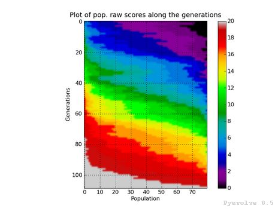

Graphical Analysis - Plots
============================================================================

Pyevolve comes with an Graphical Plotting Tool, this utility uses the great
python plotting library called Matplotlib.

.. seealso::

   :ref:`requirements` section.

You can find the Pyevolve plotting tool in your python Scripts directory, the
tool is named **pyevolve_graph.py**.

Graphical Plotting Tool Options
---------------------------------------------------------------------------

**pyevolve_graph.py**, installed in :file:`\\Python2{x}\\Scripts\\pyevolve_graph.py`.

This is the documentation where you call the *--help* option: ::

   Pyevolve 0.6rc1 - Graph Plot Tool
   By Christian S. Perone

   Usage: pyevolve_graph.py [options]

   Options:
     -h, --help            show this help message and exit
     -f FILENAME, --file=FILENAME
                           Database file to read (default is 'pyevolve.db').
     -i IDENTIFY, --identify=IDENTIFY
                           The identify of evolution.
     -o OUTFILE, --outfile=OUTFILE
                           Write the graph image to a file (don't use extension,
                           just the filename, default is png format, but you can
                           change using --extension (-e) parameter).
     -e EXTENSION, --extension=EXTENSION
                           Graph image file format. Supported options (formats)
                           are: emf, eps, pdf, png, ps, raw, rgba, svg, svgz.
                           Default is 'png'.
     -g GENRANGE, --genrange=GENRANGE
                           This is the generation range of the graph, ex: 1:30
                           (interval between 1 and 30).
     -l LINDRANGE, --lindrange=LINDRANGE
                           This is the individual range of the graph, ex: 1:30
                           (individuals between 1 and 30), only applies to
                           heatmaps.
     -c COLORMAP, --colormap=COLORMAP
                           Sets the Color Map for the graph types 8 and 9. Some
                           options are: summer, bone, gray, hot, jet, cooper,
                           spectral. The default is 'jet'.
     -m, --minimize        Sets the 'Minimize' mode, default is the Maximize
                           mode. This option makes sense if you are minimizing
                           your evaluation function.

     Graph types:
       This is the supported graph types

       -0                  Write all graphs to files. Graph types: 1, 2, 3, 4 and
                           5.
       -1                  Error bars graph (raw scores).
       -2                  Error bars graph (fitness scores).
       -3                  Max/min/avg/std. dev. graph (raw scores).
       -4                  Max/min/avg graph (fitness scores).
       -5                  Raw and Fitness min/max difference graph.
       -6                  Compare best raw score of two or more evolutions (you
                           must specify the identify comma-separed list with
                           --identify (-i) parameter, like 'one, two, three'),
                           the maximum is 6 items.
       -7                  Compare best fitness score of two or more evolutions
                           (you must specify the identify comma-separed list with
                           --identify (-i) parameter, like 'one, two, three'),
                           the maximum is 6 items.
       -8                  Show a heat map of population raw score distribution
                           between generations.
       -9                  Show a heat map of population fitness score
                           distribution between generations.

Usage
---------------------------------------------------------------------------

To use this graphical plotting tool, you need to use the :class:`DBAdapters.DBSQLite`
adapter and create the database file. Pyevolve have the "identify" concept, the value
of this parameter means the same value used in the "identify" parameter of the DB Adapter.

See this example: ::

   sqlite_adapter = DBAdapters.DBSQLite(identify="ex1")
   ga.setDBAdapter(sqlite_adapter)

This DB Adapter attached to the GA Engine will create the database file named "pyevolve.db".

.. seealso::

   `Sqliteman, a tool for sqlite3 databases <http://sqliteman.com/>`_
      I recommend the Sqliteman tool to open the database and see the contents or structure, if
      you are interested.

When you run your GA, all the statistics will be dumped to this database, and you have an ID
for this run, which is the identify parameter. So when you use the graph tool, it will read
the statistics from this database file. The "identify" parameter is passed to the tool using
the "-i" option, like this: ::

   pyevolve_graph.py -i ex1 -1

By default, this tool will use the database file named *pyevolve.db*, but you can change
using the "-f" option like this: ::
   
   pyevolve_graph.py -i ex1 -1 -f another_db.db

Usage Examples
---------------------------------------------------------------------------

**Writing graph to a file**

   PDF File: ::

      pyevolve_graph.py -i ex1 -1 -o graph_ex1 -e pdf
   
   PNG File (default extension when using "-o" option): ::
      
      pyevolve_graph.py -i ex1 -1 -o graph_ex1

**Using the generation range** ::

   # this command wil plot the evoltion of the generations between 10 and 20.
   pyevolve_graph.py -i ex1 -1 -g 10:20

**When you have minimized the evaluation function** ::

   pyevolve_graph.py -i ex1 -1 -m

**To specify an identify list (graphs "-6" and "-7")** ::

   pyevolve_graph.py -i ex1_run1,ex1_run2,ex1_run3 -6s

.. _graphs_screens:

Graph Types and Screenshots
---------------------------------------------------------------------------

Here are described all the graph types and some screenshots.

Error bars graph (raw scores) / "-1" option
^^^^^^^^^^^^^^^^^^^^^^^^^^^^^^^^^^^^^^^^^^^^^^^^^^^^^^^^^^^^^^^^^^^^^^^^^^^

In this graph, you will find the generations on the x-axis and the raw scores on
the y-axis. The green vertical bars represents the **maximum and the minimum raw
scores** of the current population at generation indicated in the x-axis. The blue
line between them is the **average raw score** of the population.

This graph was generated using: ::

   pyevolve_graph.py -i ex1 -1

Error bars graph (fitness scores) / "-2" option
^^^^^^^^^^^^^^^^^^^^^^^^^^^^^^^^^^^^^^^^^^^^^^^^^^^^^^^^^^^^^^^^^^^^^^^^^^^

The differente between this graph option and the "-1" option is that we are
using the **fitness scores** instead of the raw scores.

This graph was generated using: ::

   pyevolve_graph.py -i ex1 -2

.. note:: This graph is from a GA using the **Linear Scaling** scheme and the **Roulette
          Wheel** selection method.

Max/min/avg/std. dev. graph (raw scores) / "-3" option
^^^^^^^^^^^^^^^^^^^^^^^^^^^^^^^^^^^^^^^^^^^^^^^^^^^^^^^^^^^^^^^^^^^^^^^^^^^

In this graph we have the green line showing the maximum raw score at the
generation in the x-axis, the red line shows the minimum raw score, and the
blue line shows the average raw scores. The green shaded region represents
the difference between our max. and min. raw scores. The black line shows the
standard deviation of the average raw scores. 
We also have some annotations like the maximum raw score, maximum std. dev.
and the min std. dev.

This graph was generated using: ::

   pyevolve_graph.py -i ex1 -3

.. image:: imgs/graph_3_ex1.png
   :align: center

.. note:: We can see in this graph the minimum standard deviation at the
          convergence point. The GA Engine have stopped the evolution
          using this criteria.

   
Max/min/avg graph (fitness scores) / "-4" option
^^^^^^^^^^^^^^^^^^^^^^^^^^^^^^^^^^^^^^^^^^^^^^^^^^^^^^^^^^^^^^^^^^^^^^^^^^^

This graphs shows the maximum fitness score from the population at the
x-axis generation using the green line. The red line shows the minimum
fitness score and the blue line shows the average fitness score from
the population. The green shaded region between the green and red line
shows the difference between the best and worst individual of population.

This graph was generated using: ::

   pyevolve_graph.py -i ex1 -4

.. note:: This graph is from a GA using the **Linear Scaling** scheme and the **Roulette
          Wheel** selection method.

Min/max difference graph, raw and fitness scores / "-5" option
^^^^^^^^^^^^^^^^^^^^^^^^^^^^^^^^^^^^^^^^^^^^^^^^^^^^^^^^^^^^^^^^^^^^^^^^^^^

In this graph, we have two subplots, the first is the difference between
the best individual raw score and the worst individual raw score. The
second graph shows the difference between the best individual fitness score
and the worst individual fitness score
Both subplost shows the generation on the x-axis and the score difference
in the y-axis.

This graph was generated using: ::

   pyevolve_graph.py -i ex1 -5

Compare best raw score of two or more evolutions / "-6" option
^^^^^^^^^^^^^^^^^^^^^^^^^^^^^^^^^^^^^^^^^^^^^^^^^^^^^^^^^^^^^^^^^^^^^^^^^^^
This graph is used to compare two or more evolutions (the max is 6 evolutions)
of the same or different GA.

It uses a different color for each identify you use, in the example, you can
see the three evolutions (green, blue and red lines) of the same GA.

All the lines have a shaded transparent region of the same line color, they
represent the difference between the maximum and the minimum raw scores of
the evolution.

This graph was generated using: ::

   pyevolve_graph.py -i ex1_run1,ex1_run2,ex1_run3 -6

.. note:: The evolution identified by "ex1_run3" (red color) is the
          evolution in which the best raw score (20) was got first at the
          generation 80, compared to the other runs.

Compare best fitness score of two or more evolutions / "-7" option
^^^^^^^^^^^^^^^^^^^^^^^^^^^^^^^^^^^^^^^^^^^^^^^^^^^^^^^^^^^^^^^^^^^^^^^^^^^

The differente between this graph option and the "-6" option is that we are
using the **fitness scores** instead of the raw scores.

This graph was generated using: ::

   pyevolve_graph.py -i ex1_run1,ex1_run2,ex1_run3 -7

Heat map of population raw score distribution / "-8" option
^^^^^^^^^^^^^^^^^^^^^^^^^^^^^^^^^^^^^^^^^^^^^^^^^^^^^^^^^^^^^^^^^^^^^^^^^^^

The heat map graph is a plot with the population individual plotted as the
x-axis and the generation plotted in the y-axis. On the right side we have
a legend with the color/score relation. As you can see, on the initial
populations, the last individals scores are the worst (represented in this
colormap with the dark blue). To create this graph, we use the Gaussian
interpolation method.

This graph was generated using: ::

   pyevolve_graph.py -i ex1 -8

Using another colormap like the "spectral", we can see more interesting
patterns:

This graph was generated using: ::

   pyevolve_graph.py -i ex1 -8 -c spectral

.. warning:: This graph generation can be very slow if you have too many generations.
             You can use the "-g" option to limit your generations.

Heat map of population fitness score distribution / "-9" option
^^^^^^^^^^^^^^^^^^^^^^^^^^^^^^^^^^^^^^^^^^^^^^^^^^^^^^^^^^^^^^^^^^^^^^^^^^^

The differente between this graph option and the "-8" option is that we are
using the **fitness scores** instead of the raw scores.

This graph was generated using: ::

   pyevolve_graph.py -i ex1 -9
   

.. note:: Here you can note some interesting thing, in this graph of the scaled
          score, the individuals fitness seems almost equaly distributed in the
          population.

Now, the same plot using the "hot" colormap.

This graph was generated using: ::

   pyevolve_graph.py -i ex1 -9 -c hot
   

.. warning:: This graph generation can be very slow if you have too many generations.
             You can use the "-g" option to limit your generations.