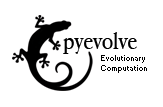

Welcome to Pyevolve documentation !
=================================================

"*We can allow satellites, planets, suns, universe, nay whole systems of universe, to
be governed by laws, but the smallest insect, we wish to be created at once by special act.*"

\- **Charles R. Darwin, 1838**

Pyevolve was developed to be a *complete genetic algorithm framework written in pure python*, but since the version 0.6,
the framework is also supporting Genetic Programming, so in the near future, the framework will be more an Evolutionary
Algorithm framework than a simple GA framework.

See the changes in the :ref:`whatsnew` section of this documentation.

See some plot screenshots on the :ref:`graphs_screens` section.

Get Involved !
--------------------
Join with us in `Pyevolve mail-list <http://groups.google.com/group/pyevolve>`_.

Development information and bug reports are in the `Trac <http://sourceforge.net/apps/trac/pyevolve>`_, 
and please, feel free to create new tickets with critics or suggestions.

Visit the project `blog site <http://pyevolve.sourceforge.net/wordpress>`_ and leave your comment.

Contents
--------------------------------------------------

.. toctree::
   :maxdepth: 4

   whatsnew
   intro
   getstarted
   modules
   graphs
   examples
   faq
   contributors
   license
   contact

Index
-----------------------------------

* :ref:`genindex`
* :ref:`modindex`

This documentation was updated on |today|.
